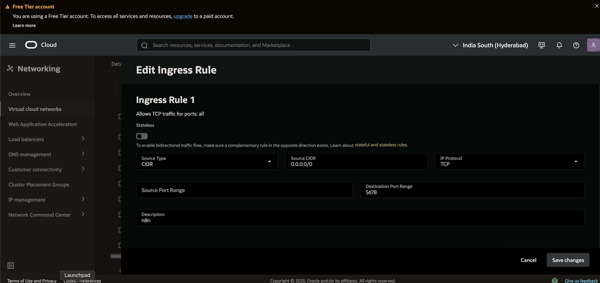
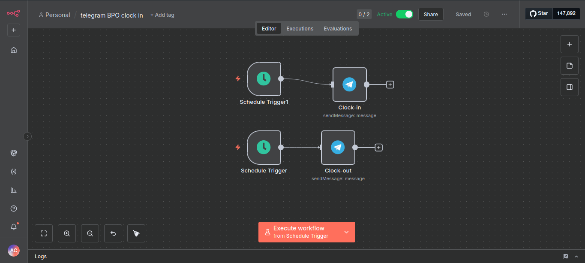
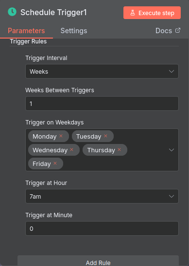
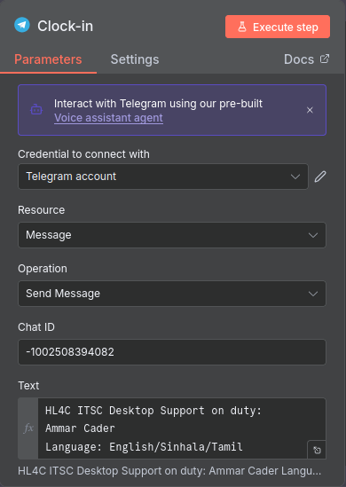

# n8n Work Check-in Bot

Automates Telegram messages for work check-in/check-out using n8n

## The Goal:
The main goal for this project was to make use of the trending tool "n8n" and gain experience with it, by also making my tasks more automated
Credits to:[NetworkChuck](https://youtu.be/ONgECvZNI3o?si=IsbIltj83qwWUSsV)

## Features
- Sends check-in messages at 7 AM (Mon–Fri)
- Sends check-out messages at 3 PM (Mon–Fri)
- Skip holidays via AI commands

## My Setup/Prerequisite
- n8n installed in docker container
- Oracle free tier machine 1gb RAM
- Ubuntu Server
- Docker installed
- A method to expose to public

## Process

### n8n installation/setup 

Started by installing n8n in a docker container with the following docker-compose.yaml:

```yaml
version: "3.8"
services:
n8n:
image: n8nio/n8n
restart: unless-stopped
ports:
- "5678:5678"
environment:
- N8N_BASIC_AUTH_ACTIVE=true
- N8N_BASIC_AUTH_USER=admin
- N8N_BASIC_AUTH_PASSWORD=password
- GENERIC_TIMEZONE=Asia/Colombo
- NODE_ENV=production
- N8N_SECURE_COOKIE=false
volumes:
- /home/ubuntu/n8n_data:/home/node/.n8n
```
- n8n installed in docker container
- running on port 5678

### Allowing network traffic on Oracle Cloud for port "5678"

Allowed network traffic to port 5678 of my cloud server 


### Accessing n8n from local machine
Since n8n was installed on my cloud machine which running ubuntu server cli, after exposing the port to public I accessed the n8n with <server public ip address>:5678 which worked.
-Proceeded with the inital basic setup with few details which needed to be set

### Creating the workflow
The workflow basic structure is constructed with two triggers which are for the "Check in" and "Check out" times so when it reaches the specified time and day it would run the workflow


**What needs to be done to allow n8n to communicate with telegram:**
1. Create a Telegram Bot (refer to: [Create a telegram bot](https://gist.github.com/nafiesl/4ad622f344cd1dc3bb1ecbe468ff9f8a#create-a-telegram-bot-and-get-a-bot-token))
2. Add it to the relevant group for the message
3. Get GROUP CHAT ID for the relevant group to receive the automated Clock-in/Clock-out message(refer to: [getting GROUP ID](https://gist.github.com/nafiesl/4ad622f344cd1dc3bb1ecbe468ff9f8a#get-chat-id-for-a-group-chat))

This resource can be used for getting Chat ID whether it is a group or any other chat method but the bot needs to be already in the required chat: (https://gist.github.com/nafiesl/4ad622f344cd1dc3bb1ecbe468ff9f8a#get-chat-id-for-a-group-chat) 

**n8n workflow**
1. Started by creating a workflow then adding a "Schedule Trigger" with following rules.



2. Then by adding a telegram "Send text message" the job is done. this node with rules added and with the api also to make the comunication possible.



Now since the clock in process was done the clockout autnomation didnt have much to do after just duplicating the "Clock-in" process. Just few changes such as the trigger's time changed to the "Clock-out" time and also in telegram "Send text message" node the clock in message was changed to the clockout message.
 
